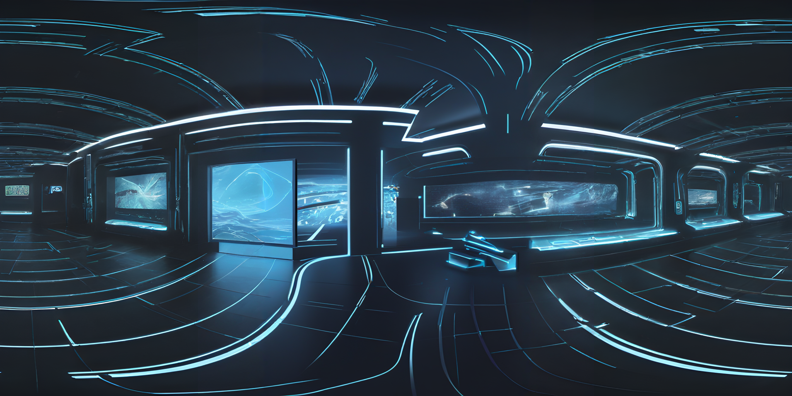

# sdxl-panoramic-inpaint Cog model

This is a custom model implementing a workflow to get a seamless 360 sdxl image, as a Cog model. [Cog packages machine learning models as standard containers.](https://github.com/replicate/cog)

First, download the pre-trained weights:

    cog run script/download-weights

Then, you can run predictions:

    cog predict -i prompt="tron world"

## Workflow:

1.SDXL image 1024x512

2. Cut image in half vertically, swap left and right sections

3. GFPGAN upscale 2x

4. Crop out 1024x1024 middle section to inpaint seam

5. Put flush seam back into upscaled image

